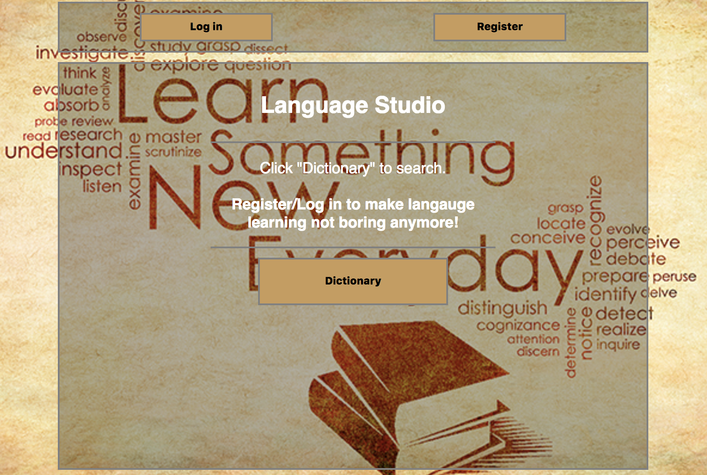
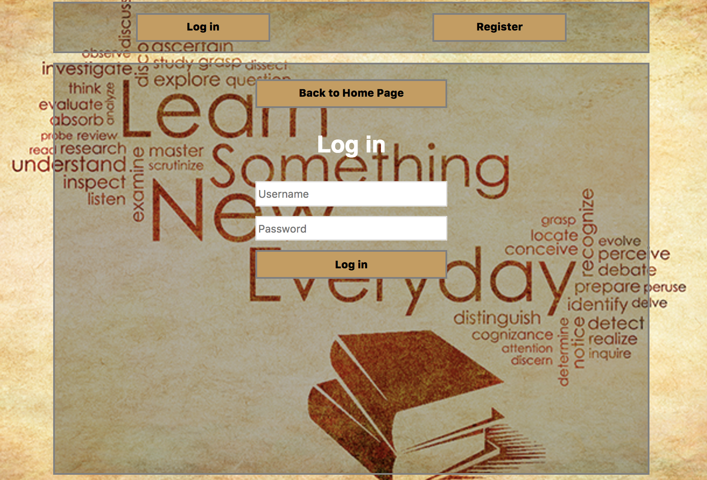
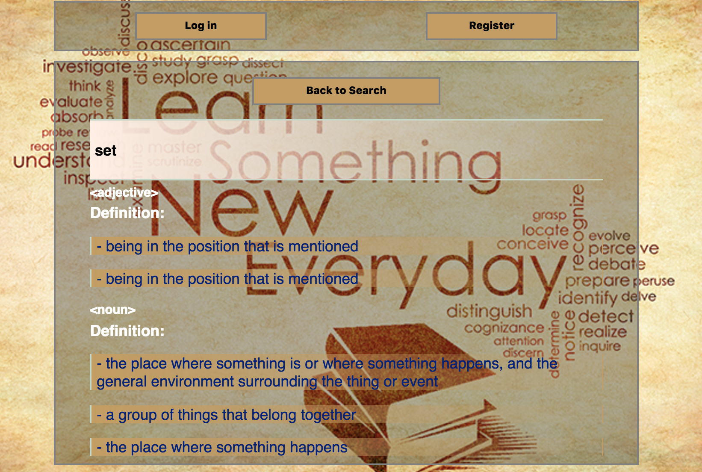
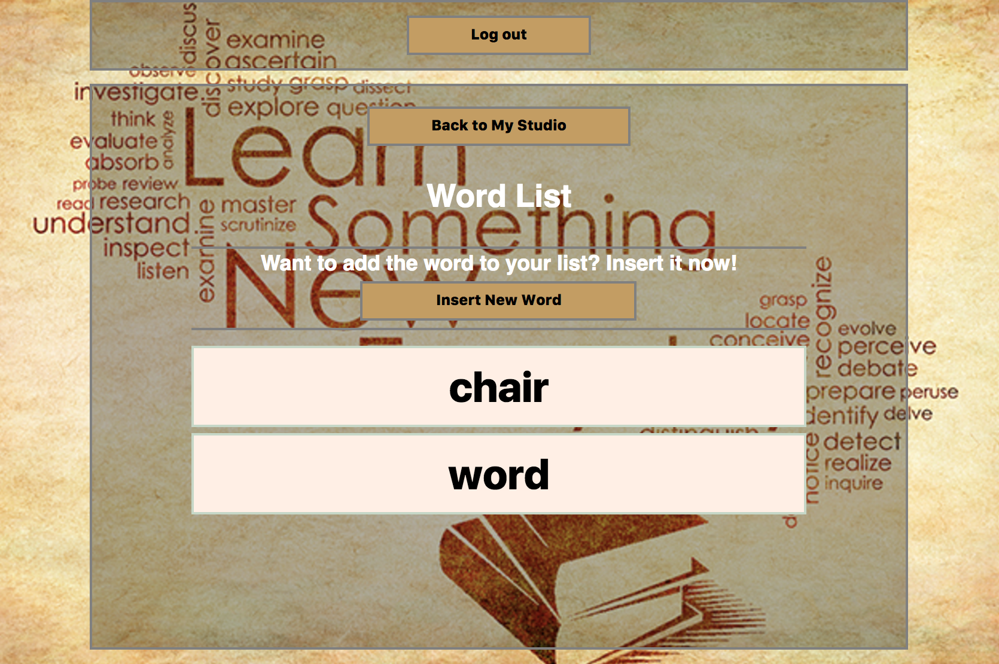

# Language Studio

This is a Ruby on Rails educational app designed for English language learners. Users could look up definition of words using the dictionary, powered by Pearson Dictionary API. Also, after register and log in, users could build their own word list with editing and deleting functions as well.

## Screenshots

